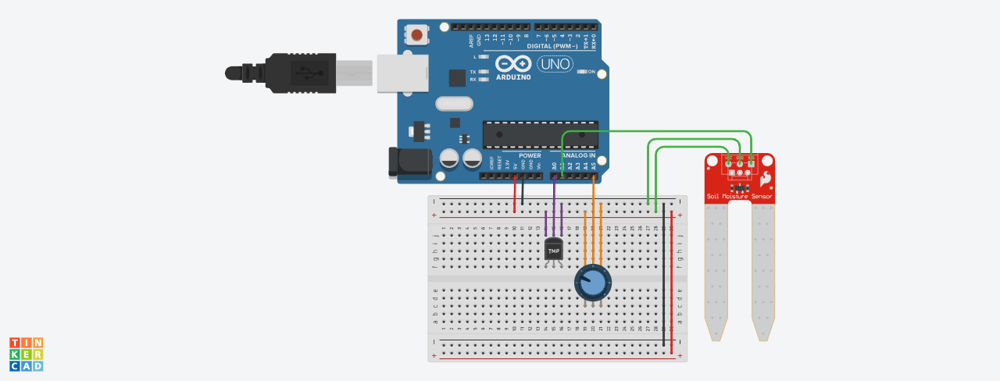
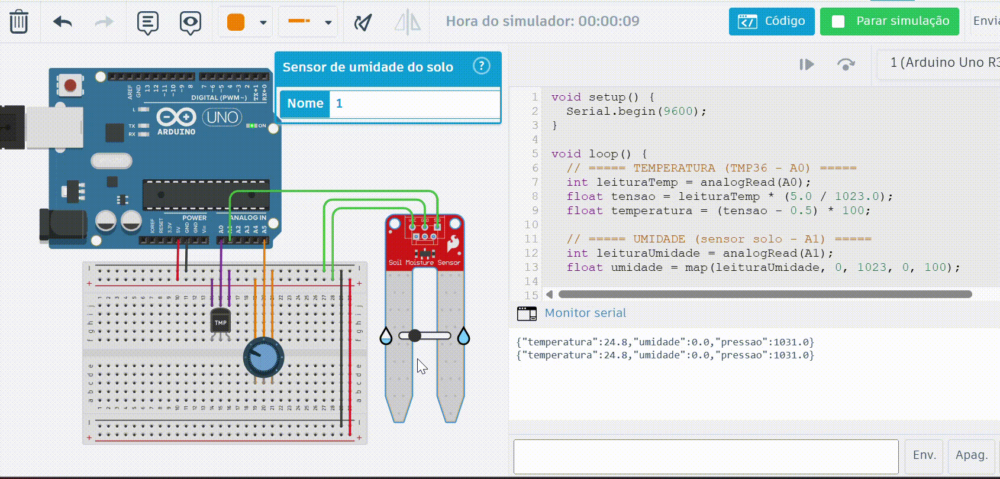

# 🌡️ Estação Meteorológica IoT

## 📌 Descrição

Este projeto consiste no desenvolvimento de um sistema completo de estação meteorológica IoT, integrando hardware simulado, backend com API REST, banco de dados e interface web para visualização dos dados.

O sistema coleta dados de sensores, envia via comunicação serial para um servidor em Python (Flask), armazena em banco SQLite e exibe em um dashboard interativo.

---

## 🏗️ Arquitetura do Sistema

O sistema é dividido em três camadas:

* **Dispositivo (Hardware)**
  Simulado no Tinkercad com Arduino Uno e sensores

* **Servidor (Backend)**
  Python + Flask + SQLite

* **Interface (Frontend)**
  HTML + CSS + JavaScript

---

## 🧠 O que eu desenvolvi

- Simulação de sensores utilizando Arduino no Tinkercad
- Envio de dados em formato JSON via comunicação serial
- API REST completa com Flask
- Banco de dados SQLite com operações CRUD
- Interface web com visualização dos dados
- Dashboard com estatísticas e gráfico de temperatura

---

## 🔌 Simulação do Hardware

Foi utilizada uma simulação no Tinkercad devido à indisponibilidade de hardware físico.

A simulação pode ser acessada em: [Thinkercad](https://www.tinkercad.com/things/ktEh5qbsMOZ/editel?returnTo=%2Fdashboard&sharecode=E-ZPyqz92Dpfuj3Jf3u44UCTWdBKYsSmvYI1Vte-Rbo)


### 🧩 Componentes utilizados

- Arduino Uno
- Sensor de temperatura TMP36
- Sensor de umidade do solo (adaptado para simular umidade do ar)
- Potenciômetro (utilizado para simular pressão atmosférica)

### ⚙️ Como funciona

- O TMP36 mede a temperatura através de leitura analógica
- O sensor de umidade fornece um valor proporcional convertido para %
- O potenciômetro permite variar manualmente um valor que simula pressão
- Os dados são enviados a cada 5 segundos via Serial no formato JSON

**Exemplo de saída:**

{"temperatura":24.5,"umidade":63.2,"pressao":1002.4}

### 🖼️ Simulação

#### 📷 Circuito no Thinkercad



#### 🎥 Simulação em execução



O código utilizado na simulação pode ser encontrado em: [sketch.ino](arduino/sketch.ino)
---

## 🧠 Backend (API REST)

O backend foi desenvolvido em Python utilizando Flask.

Ele é responsável por:

- Receber dados dos sensores (POST)
- Armazenar no banco
- Disponibilizar endpoints para consulta
- Calcular estatísticas


O backend implementa os seguintes endpoints:

| Método | Rota                | Descrição        |
| ------ | ------------------- | ---------------- |
| GET    | `/`                 | Últimas leituras |
| GET    | `/leituras`         | Histórico        |
| POST   | `/leituras`         | Criar leitura    |
| GET    | `/leituras/<id>`    | Detalhe          |
| PUT    | `/leituras/<id>`    | Atualizar        |
| DELETE | `/leituras/<id>`    | Deletar          |
| GET    | `/api/estatisticas` | Estatísticas     |

---

## 🗄️ Banco de Dados

Foi utilizado SQLite para persistência dos dados.

A tabela principal contém:

- id (autoincremento)
- temperatura
- umidade
- pressão
- timestamp

Também implementei:

- inserção de dados
- listagem com paginação
- edição
- remoção

---

## 💻 Interface Web

A interface foi desenvolvida com HTML, CSS e JavaScript.

O sistema possui:

* Dashboard com últimas leituras
* Estatísticas (média, mínimo e máximo)
* Gráfico de variação de temperatura
* Página de histórico com exclusão
* Página de edição de dados

A interface pode ser visualizada abaixo:


---

## ⚙️ Como executar o projeto

### 1. Clonar o repositório

```bash
git clone <URL_DO_REPOSITORIO>
cd <NOME_DO_PROJETO>
```

### 2. Criar ambiente virtual

```bash
python -m venv venv
```

### 3. Ativar ambiente

```bash
# Windows
venv\Scripts\activate

# Linux/Mac
source venv/bin/activate
```

### 4. Instalar dependências

```bash
pip install flask pyserial
```

### 5. Rodar o servidor

```bash
python app.py
```

### 6. Acessar no navegador

```
http://localhost:5000
```


### 🧪 Popular banco com dados

Para popular o banco de dados, rode o script que gera dados aleatórios simulando leituras reais.

```bash
python seed.py
```

Os dados enviados seguem o formato:

```json
{
  "temperatura": 25.3,
  "umidade": 60.1,
  "pressao": 1005.2
}
```

---

## 🎯 Conclusão

O projeto demonstra a integração completa entre hardware, backend e frontend, simulando um sistema real de IoT com coleta, armazenamento e visualização de dados em tempo real.
