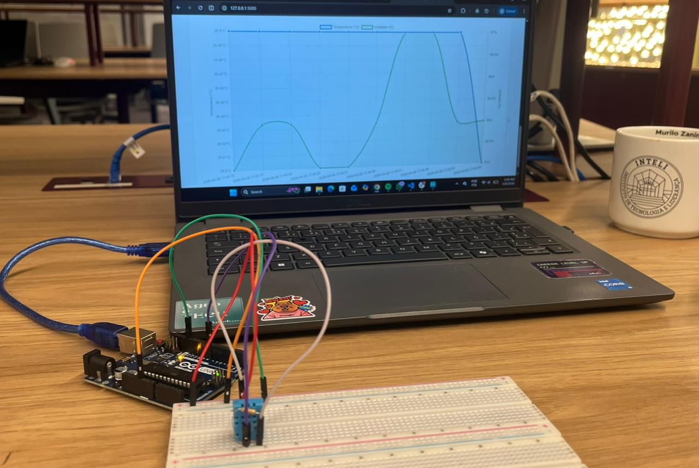

# 🌡️ Estação Meteorológica IoT

## 📌 Descrição

Este projeto consiste no desenvolvimento de um sistema completo de estação meteorológica IoT, integrando hardware simulado, backend com API REST, banco de dados e interface web para visualização dos dados.

O sistema coleta dados de sensores, envia via comunicação serial para um servidor em Python (Flask), armazena em banco SQLite e exibe em um dashboard interativo.

---

## 🧠 O que foi desenvolvido

- Simulação inicial dos sensores no Tinkercad
- Implementação física com Arduino
- Comunicação serial entre Arduino e backend
- API REST completa com Flask
- Banco de dados SQLite com CRUD
- Interface web com dashboard
- Gráfico interativo de temperatura e umidade

---

## 🔌 Hardware

### 🧪 Simulação (Tinkercad)

Inicialmente, foi criada uma simulação no Tinkercad para validar o funcionamento do sistema sem depender de hardware físico.

A simulação pode ser acessada em: [Thinkercad](https://www.tinkercad.com/things/ktEh5qbsMOZ/editel?returnTo=%2Fdashboard&sharecode=E-ZPyqz92Dpfuj3Jf3u44UCTWdBKYsSmvYI1Vte-Rbo)


#### Componentes utilizados:

- Arduino Uno
- Sensor de temperatura TMP36
- Sensor de umidade do solo (adaptado para simular umidade do ar)
- Potenciômetro (utilizado para simular pressão atmosférica)

#### Funcionamento:

- O TMP36 mede a temperatura através de leitura analógica
- O sensor de umidade fornece um valor proporcional convertido para %
- O potenciômetro permite variar manualmente um valor que simula pressão
- Os dados são enviados a cada 5 segundos via Serial no formato JSON

**Exemplo de saída:**

{"temperatura":24.5,"umidade":63.2,"pressao":1002.4}

#### 🖼️ Simulação

**Circuito no Thinkercad**


**Simulação em execução**


O código utilizado na simulação pode ser encontrado em: [sketch.ino](arduino/sketch.ino)

### 🔧 Implementação física

Posteriormente, foi realizada a montagem física utilizando:

#### Componentes:

- Arduino Uno
- Sensor DHT11 (temperatura e umidade)

#### Funcionamento:

- O DHT11 realiza a leitura de temperatura e umidade do ambiente
- Os dados são enviados via Serial em formato JSON a cada 5 segundos

#### 📷 Montagem física



**Funcionamento**


O código do hardware pode ser encontrado em: [estacao.ino](arduino/estacao/estacao.ino)

---

## 🔄 Integração com o sistema

A comunicação entre o Arduino e o backend é feita através do script `serial_reader.py`, que atua como um intermediário entre o hardware e a API.

Ele é responsável por:

- Ler continuamente os dados enviados pelo Arduino via porta serial  
- Interpretar cada linha como um JSON válido  
- Enviar os dados para a API Flask através de requisições HTTP (POST)  
- Ignorar leituras inválidas que não estejam no formato esperado  

Dessa forma, o Arduino não se comunica diretamente com o servidor, sendo necessário esse script para realizar a integração.

⚠️ Para funcionamento completo, é necessário rodar:

1. O servidor Flask:
```bash
python app.py
```

2. Em outro terminal, o leitor serial:
```bash
python serial_reader.py
```

---

## 🧠 Backend (API REST)

O backend foi desenvolvido em Python utilizando Flask.

Ele é responsável por:

- Receber dados dos sensores (POST)
- Armazenar no banco
- Disponibilizar endpoints para consulta
- Calcular estatísticas


O backend implementa os seguintes endpoints:

| Método | Rota                | Descrição        |
| ------ | ------------------- | ---------------- |
| GET    | `/`                 | Últimas leituras |
| GET    | `/leituras`         | Histórico        |
| POST   | `/leituras`         | Criar leitura    |
| GET    | `/leituras/<id>`    | Detalhe          |
| PUT    | `/leituras/<id>`    | Atualizar        |
| DELETE | `/leituras/<id>`    | Deletar          |
| GET    | `/api/estatisticas` | Estatísticas     |

---

## 🗄️ Banco de Dados

Foi utilizado SQLite para persistência dos dados.

A tabela principal contém:

- id (autoincremento)
- temperatura
- umidade
- pressão (não utilizada na interface atual)
- timestamp

*Obs: A coluna de pressão foi mantida no modelo de dados por compatibilidade com a versão inicial do projeto (simulação no Tinkercad), porém não foi utilizada na implementação física final.*

Também implementei:

- inserção de dados
- listagem com paginação
- edição
- remoção

---

## 💻 Interface Web

A interface foi desenvolvida com HTML, CSS e JavaScript.

O sistema possui:

* Dashboard com últimas leituras
* Estatísticas (média, mínimo e máximo)
* Gráfico de variação de temperatura
* Página de histórico com exclusão
* Página de edição de dados

A interface pode ser visualizada abaixo:


---

## ⚙️ Como executar o projeto

### 1. Clonar o repositório

```bash
git clone <URL_DO_REPOSITORIO>
cd <NOME_DO_PROJETO>
```

### 2. Criar ambiente virtual

```bash
python -m venv venv
```

### 3. Ativar ambiente

```bash
# Windows
venv\Scripts\activate

# Linux/Mac
source venv/bin/activate
```

### 4. Instalar dependências

```bash
pip install flask pyserial
```

### 5. Rodar o sistema

```bash
python app.py
```
Em outro terminal:

```bash
python serial_reader.py
```

### 6. Acessar no navegador

```
http://localhost:5000
```


### 🧪 Dados de exemplo

O repositório inclui um banco de dados (`dados.db`) com leituras já inseridas.

Caso queira gerar novos dados:

```bash
python seed.py
```

---

## 🎯 Conclusão

O projeto demonstra a integração completa entre hardware, backend e frontend, simulando um sistema real de IoT com coleta, armazenamento e visualização de dados em tempo real.

A utilização de simulação e implementação física permitiu validar o sistema em diferentes contextos, garantindo robustez e funcionamento real.
